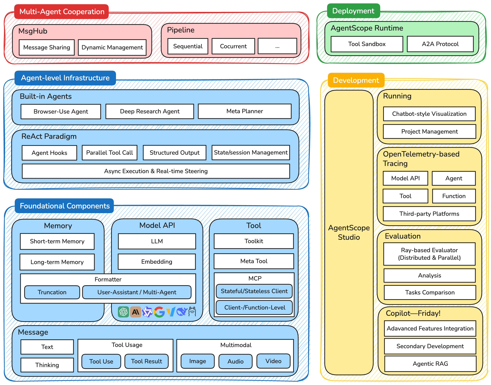
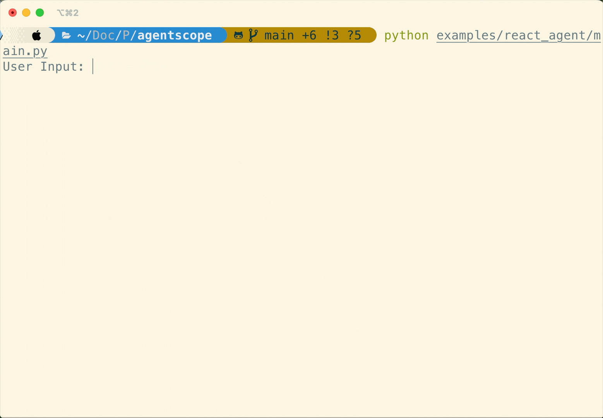
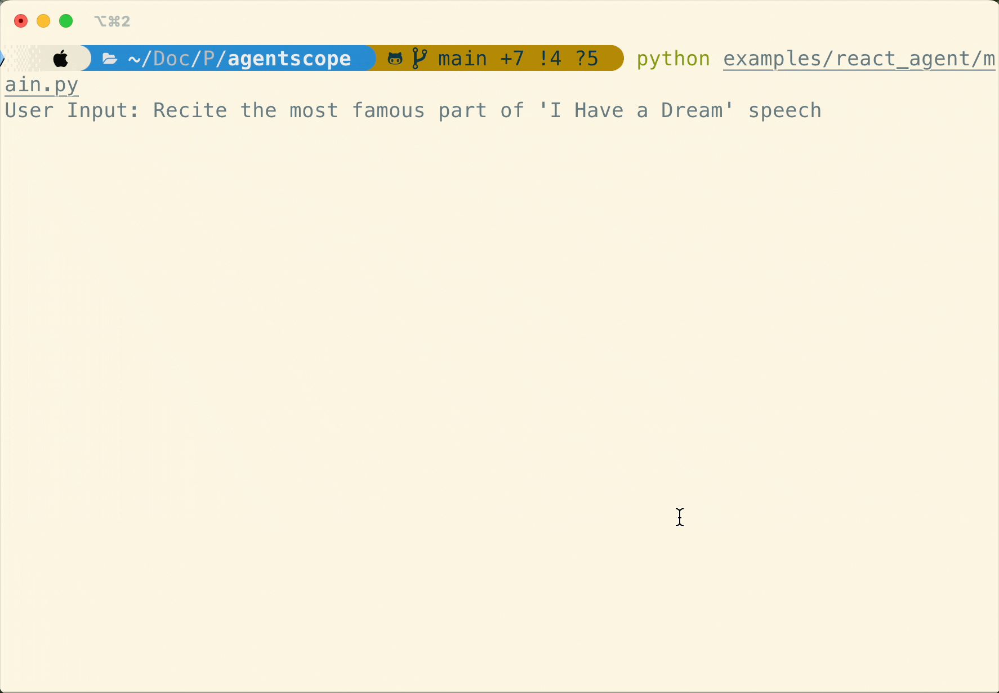
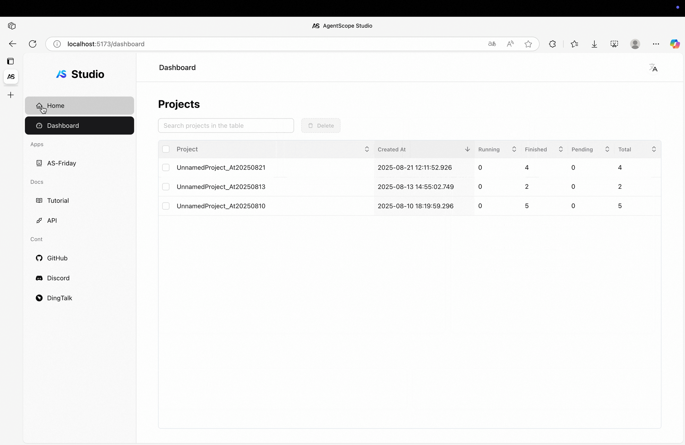
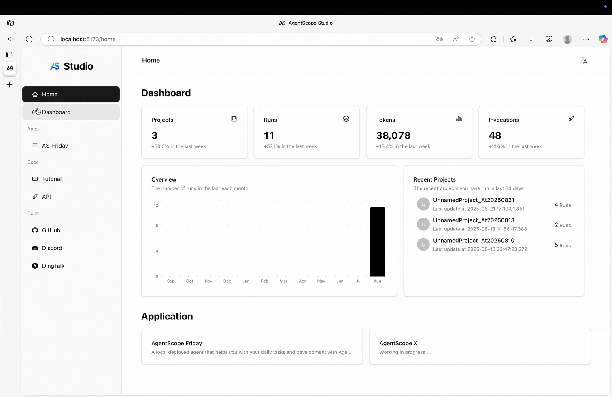
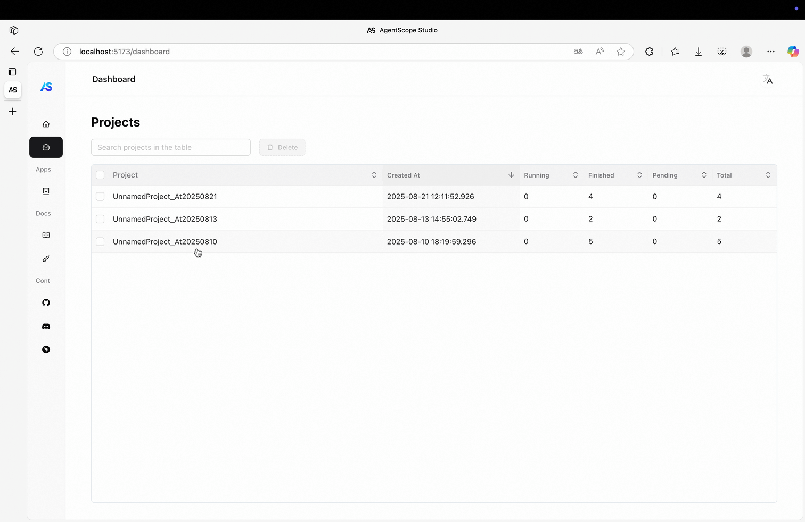
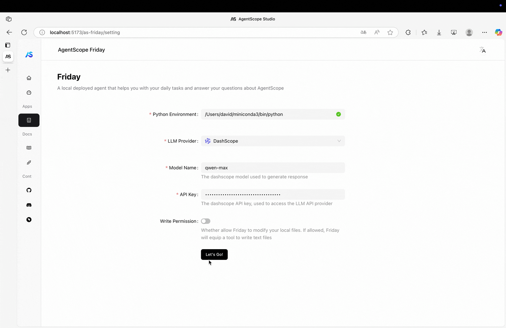

[**中文主页**](https://github.com/agentscope-ai/agentscope/blob/main/README_zh.md) | [**Tutorial**](https://doc.agentscope.io/) | [**Roadmap**](https://github.com/agentscope-ai/agentscope/blob/main/docs/roadmap.md) | [**FAQ**](https://doc.agentscope.io/tutorial/faq.html)

<p align="center">
  
</p>

<h2 align="center">AgentScope: Agent-Oriented Programming for Building LLM Applications</h2>

<p align="center">
    <a href="https://arxiv.org/abs/2402.14034">
        
    </a>
    <a href="https://pypi.org/project/agentscope/">
        
    </a>
    <a href="https://pypi.org/project/agentscope/">
        
    </a>
    <a href="https://doc.agentscope.io/">
        
    </a>
    <a href="https://agentscope.io/">
        
    </a>
    <a href="./LICENSE">
        
    </a>
</p>

<p align="center">

</p>

## ✨ Why AgentScope?

Easy for beginners, powerful for experts.

<p align="center">

</p>

- **Transparent to Developers**: Transparent is our **FIRST principle**. Prompt engineering, API invocation, agent building, workflow orchestration, all are visible and controllable for developers. No deep encapsulation or implicit magic.
- **[Realtime Steering](https://doc.agentscope.io/tutorial/task_agent.html#realtime-steering)**: Native support for realtime interruption and customized handling.
- **More Agentic**: Support [agentic tools management](https://doc.agentscope.io/tutorial/task_tool.html), [agentic long-term memory control](https://doc.agentscope.io/tutorial/task_long_term_memory.html) and agentic RAG, etc.
- **Model Agnostic**: Programming once, run with all models.
- **LEGO-style Agent Building**: All components are **modular** and **independent**.
- **Multi-Agent Oriented**: Designed for **multi-agent**, **explicit** message passing and workflow orchestration, NO deep encapsulation.
- **Highly Customizable**: Tools, prompt, agent, workflow, third-party libs & visualization, customization is encouraged everywhere.

Quick overview of important features in **AgentScope 1.0**:

| Module     | Feature                                                                            | Tutorial                                                                |
|------------|------------------------------------------------------------------------------------|-------------------------------------------------------------------------|
| model      | Support async invocation                                                           | [Model](https://doc.agentscope.io/tutorial/task_model.html)             |
|            | Support reasoning model                                                            |                                                                         |
|            | Support streaming/non-streaming returns                                            |                                                                         |
| tool       | Support async/sync tool functions                                                  | [Tool](https://doc.agentscope.io/tutorial/task_tool.html)               |
|            | Support streaming/non-streaming returns                                            |                                                                         |
|            | Support user interruption                                                          |                                                                         |
|            | Support post-processing                                                            |                                                                         |
|            | Support group-wise tools management                                                |                                                                         |
|            | Support agentic tools management by meta tool                                      |                                                                         |
| MCP        | Support streamable HTTP/SSE/StdIO transport                                        | [MCP](https://doc.agentscope.io/tutorial/task_mcp.html)                 |
|            | Support both **stateful** and **stateless** mode MCP Client                        |                                                                         |
|            | Support client- & function-level fine-grained control                              |                                                                         |
| agent      | Support async execution                                                            |                                                                         |
|            | Support parallel tool calls                                                        |                                                                         |
|            | Support realtime steering interruption and customized handling                     |                                                                         |
|            | Support automatic state management                                                 |                                                                         |
|            | Support agent-controlled long-term memory                                          |                                                                         |
|            | Support agent hooks                                                                |                                                                         |
| tracing    | Support OpenTelemetry-based tracing in LLM, tools, agent and formatter             | [Tracing](https://doc.agentscope.io/tutorial/task_tracing.html)         |
|            | Support connecting to third-party tracing platforms (e.g. Arize-Phoenix, Langfuse) |                                                                         |
| memory     | Support long-term memory                                                           | [Memory](https://doc.agentscope.io/tutorial/task_long_term_memory.html) |
| session    | Provide session/application-level automatic state management                       | [Session](https://doc.agentscope.io/tutorial/task_state.html)           |
| evaluation | Provide distributed and parallel evaluation                                        | [Evaluation](https://doc.agentscope.io/tutorial/task_eval.html)         |
| formatter  | Support multi-agent prompt formatting with tools API                               | [Prompt Formatter](https://doc.agentscope.io/tutorial/task_prompt.html) |
|            | Support truncation-based formatter strategy                                        |                                                                         |
| plan       | Support ReAct-based long-term planning                                             | [Plan](https://doc.agentscope.io/tutorial/task_plan.html)               |
|            | Support manual plan specification                                                  |                                                                         |
| RAG        | Support agentic RAG                                                                | [RAG](https://doc.agentscope.io/tutorial/task_rag.html)                 |
|            | Support multimodal RAG                                                             |                                                                         |
| ...        |                                                                                    |                                                                         |

## 📢 News
- **[2025-09]** **RAG** module in AgentScope 1.0 is online now! Check our [tutorial](https://doc.agentscope.io/tutorial/task_rag.html) and [example](https://github.com/agentscope-ai/agentscope/tree/main/examples/functionality/rag) for more details.
- **[2025-09]** **Voice agent** is online! `ReActAgent` supports Qwen-Omni and GPT-Audio natively now, check our [new example](https://github.com/agentscope-ai/agentscope/tree/main/examples/agent/voice_agent) and [roadmap](https://github.com/agentscope-ai/agentscope/issues/773).
- **[2025-09]** A new powerful 📋**Plan** module is online now! Check out the [tutorial](https://doc.agentscope.io/tutorial/task_plan.html) for more details.
- **[2025-09]** **AgentScope Runtime** is open-sourced now! Enabling effective agent deployment with sandboxed tool execution for production-ready AI applications. Check out the [GitHub repo](https://github.com/agentscope-ai/agentscope-runtime).
- **[2025-09]** **AgentScope Studio** is open-sourced now! Check out the [GitHub repo](https://github.com/agentscope-ai/agentscope-studio).
- **[2025-08]** The new tutorial of v1 is online now! Check out the [tutorial](https://doc.agentscope.io) for more details.
- **[2025-08]** 🎉🎉 AgentScope v1 is released now! This version fully embraces the asynchronous execution, providing many new features and improvements. Check out [changelog](https://github.com/agentscope-ai/agentscope/blob/main/docs/changelog.md) for detailed changes.

## 💬 Contact

Welcome to join our community on

| [Discord](https://discord.gg/eYMpfnkG8h)                                                                                         | DingTalk                                                                                                                          |
|----------------------------------------------------------------------------------------------------------------------------------|-----------------------------------------------------------------------------------------------------------------------------------|
|  |  |

<!-- START doctoc generated TOC please keep comment here to allow auto update -->
<!-- DON'T EDIT THIS SECTION, INSTEAD RE-RUN doctoc TO UPDATE -->
## 📑 Table of Contents

- [🚀 Quickstart](#-quickstart)
  - [💻 Installation](#-installation)
    - [🛠️ From source](#-from-source)
    - [📦 From PyPi](#-from-pypi)
- [📝 Example](#-example)
  - [👋 Hello AgentScope!](#-hello-agentscope)
  - [🎯 Realtime Steering](#-realtime-steering)
  - [🛠️ Fine-Grained MCP Control](#-fine-grained-mcp-control)
  - [🧑‍🤝‍🧑 Multi-Agent Conversation](#-multi-agent-conversation)
  - [💻 AgentScope Studio](#-agentscope-studio)
- [📖 Documentation](#-documentation)
- [⚖️ License](#-license)
- [📚 Publications](#-publications)
- [✨ Contributors](#-contributors)

<!-- END doctoc generated TOC please keep comment here to allow auto update -->

## 🚀 Quickstart

### 💻 Installation

> AgentScope requires **Python 3.10** or higher.

#### 🛠️ From source

```bash
# Pull the source code from GitHub
git clone -b main https://github.com/agentscope-ai/agentscope.git

# Install the package in editable mode
cd agentscope
pip install -e .
```

#### 📦 From PyPi

```bash
pip install agentscope
```

## 📝 Example

### 👋 Hello AgentScope!

Start with a conversation between user and a ReAct agent 🤖 named "Friday"!

```python
from agentscope.agent import ReActAgent, UserAgent
from agentscope.model import DashScopeChatModel
from agentscope.formatter import DashScopeChatFormatter
from agentscope.memory import InMemoryMemory
from agentscope.tool import Toolkit, execute_python_code, execute_shell_command
import os, asyncio


async def main():
    toolkit = Toolkit()
    toolkit.register_tool_function(execute_python_code)
    toolkit.register_tool_function(execute_shell_command)

    agent = ReActAgent(
        name="Friday",
        sys_prompt="You're a helpful assistant named Friday.",
        model=DashScopeChatModel(
            model_name="qwen-max",
            api_key=os.environ["DASHSCOPE_API_KEY"],
            stream=True,
        ),
        memory=InMemoryMemory(),
        formatter=DashScopeChatFormatter(),
        toolkit=toolkit,
    )

    user = UserAgent(name="user")

    msg = None
    while True:
        msg = await agent(msg)
        msg = await user(msg)
        if msg.get_text_content() == "exit":
            break

asyncio.run(main())
```

### 🎯 Realtime Steering

Natively support **realtime interruption** in ``ReActAgent`` with robust memory preservation, and convert interruption into an **observable event** for agent to seamlessly resume conversations.

<p align="center">
  
  
</p>

### 🛠️ Fine-Grained MCP Control

Developers can obtain the MCP tool as a **local callable function**, and use it anywhere (e.g. call directly, pass to agent, wrap into a more complex tool, etc.)

```python
from agentscope.mcp import HttpStatelessClient
from agentscope.tool import Toolkit
import os

async def fine_grained_mcp_control():
    # Initialize the MCP client
    client = HttpStatelessClient(
        name="gaode_mcp",
        transport="streamable_http",
        url=f"https://mcp.amap.com/mcp?key={os.environ['GAODE_API_KEY']}",
    )

    # Obtain the MCP tool as a **local callable function**, and use it anywhere
    func = await client.get_callable_function(func_name="maps_geo")

    # Option 1: Call directly
    await func(address="Tiananmen Square", city="Beijing")

    # Option 2: Pass to agent as a tool
    toolkit = Toolkit()
    toolkit.register_tool_function(func)
    # ...

    # Option 3: Wrap into a more complex tool
    # ...
```

### 🧑‍🤝‍🧑 Multi-Agent Conversation

AgentScope provides ``MsgHub`` and pipelines to streamline multi-agent conversations, offering efficient message routing and seamless information sharing

```python
from agentscope.pipeline import MsgHub, sequential_pipeline
from agentscope.message import Msg
import asyncio

async def multi_agent_conversation():
    # Create agents
    agent1 = ...
    agent2 = ...
    agent3 = ...
    agent4 = ...

    # Create a message hub to manage multi-agent conversation
    async with MsgHub(
        participants=[agent1, agent2, agent3],
        announcement=Msg("Host", "Introduce yourselves.", "assistant")
    ) as hub:
        # Speak in a sequential manner
        await sequential_pipeline([agent1, agent2, agent3])
        # Dynamic manage the participants
        hub.add(agent4)
        hub.delete(agent3)
        await hub.broadcast(Msg("Host", "Goodbye!", "assistant"))

asyncio.run(multi_agent_conversation())
```

### 💻 AgentScope Studio

Use the following command to install and start AgentScope Studio, to trace and visualize your agent application.

```bash
npm install -g @agentscope/studio

as_studio
```

<p align="center">
    
    
    
    
</p>


## 📖 Documentation

- Tutorial
  - [Installation](https://doc.agentscope.io/tutorial/quickstart_installation.html)
  - [Key Concepts](https://doc.agentscope.io/tutorial/quickstart_key_concept.html)
  - [Create Message](https://doc.agentscope.io/tutorial/quickstart_message.html)
  - [ReAct Agent](https://doc.agentscope.io/tutorial/quickstart_agent.html)
- Workflow
  - [Conversation](https://doc.agentscope.io/tutorial/workflow_conversation.html)
  - [Multi-Agent Debate](https://doc.agentscope.io/tutorial/workflow_multiagent_debate.html)
  - [Concurrent Agents](https://doc.agentscope.io/tutorial/workflow_concurrent_agents.html)
  - [Routing](https://doc.agentscope.io/tutorial/workflow_routing.html)
  - [Handoffs](https://doc.agentscope.io/tutorial/workflow_handoffs.html)
- FAQ
  - [FAQ](https://doc.agentscope.io/tutorial/faq.html)
- Task Guides
  - [Model](https://doc.agentscope.io/tutorial/task_model.html)
  - [Prompt Formatter](https://doc.agentscope.io/tutorial/task_prompt.html)
  - [Tool](https://doc.agentscope.io/tutorial/task_tool.html)
  - [Memory](https://doc.agentscope.io/tutorial/task_memory.html)
  - [Long-Term Memory](https://doc.agentscope.io/tutorial/task_long_term_memory.html)
  - [Agent](https://doc.agentscope.io/tutorial/task_agent.html)
  - [Pipeline](https://doc.agentscope.io/tutorial/task_pipeline.html)
  - [Plan](https://doc.agentscope.io/tutorial/task_plan.html)
  - [State/Session Management](https://doc.agentscope.io/tutorial/task_state.html)
  - [Agent Hooks](https://doc.agentscope.io/tutorial/task_hook.html)
  - [MCP](https://doc.agentscope.io/tutorial/task_mcp.html)
  - [AgentScope Studio](https://doc.agentscope.io/tutorial/task_studio.html)
  - [Tracing](https://doc.agentscope.io/tutorial/task_tracing.html)
  - [Evaluation](https://doc.agentscope.io/tutorial/task_eval.html)
  - [Embedding](https://doc.agentscope.io/tutorial/task_embedding.html)
  - [Token](https://doc.agentscope.io/tutorial/task_token.html)
- API
  - [API Docs](https://doc.agentscope.io/api/agentscope.html)
- [Examples](https://github.com/agentscope-ai/agentscope/tree/main/examples)
  - Functional
    - [MCP](https://github.com/agentscope-ai/agentscope/tree/main/examples/functionality/mcp)
    - [Plan](https://github.com/agentscope-ai/agentscope/tree/main/examples/functionality/plan)
    - [Structured Output](https://github.com/agentscope-ai/agentscope/tree/main/examples/functionality/structured_output)
    - [RAG](https://github.com/agentscope-ai/agentscope/tree/main/examples/functionality/rag)
    - [Long-Term Memory](https://github.com/agentscope-ai/agentscope/tree/main/examples/functionality/long_term_memory)
    - [Session with SQLite](https://github.com/agentscope-ai/agentscope/tree/main/examples/functionality/session_with_sqlite)
    - [Stream Printing Messages](https://github.com/agentscope-ai/agentscope/tree/main/examples/functionality/stream_printing_messages)
  - Agent
    - [ReAct Agent](https://github.com/agentscope-ai/agentscope/tree/main/examples/react_agent)
    - [Voice Agent](https://github.com/agentscope-ai/agentscope/tree/main/examples/agent/voice_agent)
    - [Deep Research Agent](https://github.com/agentscope-ai/agentscope/tree/main/examples/agent_deep_research)
    - [Browser-use Agent](https://github.com/agentscope-ai/agentscope/tree/main/examples/agent_browser)
    - [Meta Planner Agent](https://github.com/agentscope-ai/agentscope/tree/main/examples/meta_planner_agent)
  - Game
    - [Nine-player Werewolves](https://github.com/agentscope-ai/agentscope/tree/main/examples/game/werewolves)
  - Workflow
    - [Multi-agent Debate](https://github.com/agentscope-ai/agentscope/tree/main/examples/workflows/multiagent_debate)
    - [Multi-agent Conversation](https://github.com/agentscope-ai/agentscope/tree/main/examples/workflows/multiagent_conversation)
    - [Multi-agent Concurrent](https://github.com/agentscope-ai/agentscope/tree/main/examples/workflows/multiagent_concurrent)
  - Evaluation
    - [ACEBench](https://github.com/agentscope-ai/agentscope/tree/main/examples/evaluation/ace_bench)


## ⚖️ License

AgentScope is released under Apache License 2.0.

## 📚 Publications

If you find our work helpful for your research or application, please cite our papers.

- [AgentScope 1.0: A Developer-Centric Framework for Building Agentic Applications](https://arxiv.org/abs/2508.16279)

- [AgentScope: A Flexible yet Robust Multi-Agent Platform](https://arxiv.org/abs/2402.14034)

```
@article{agentscope_v1,
    author  = {
        Dawei Gao,
        Zitao Li,
        Yuexiang Xie,
        Weirui Kuang,
        Liuyi Yao,
        Bingchen Qian,
        Zhijian Ma,
        Yue Cui,
        Haohao Luo,
        Shen Li,
        Lu Yi,
        Yi Yu,
        Shiqi He,
        Zhiling Luo,
        Wenmeng Zhou,
        Zhicheng Zhang,
        Xuguang He,
        Ziqian Chen,
        Weikai Liao,
        Farruh Isakulovich Kushnazarov,
        Yaliang Li,
        Bolin Ding,
        Jingren Zhou}
    title   = {AgentScope 1.0: A Developer-Centric Framework for Building Agentic Applications},
    journal = {CoRR},
    volume  = {abs/2508.16279},
    year    = {2025},
}

@article{agentscope,
    author  = {
        Dawei Gao,
        Zitao Li,
        Xuchen Pan,
        Weirui Kuang,
        Zhijian Ma,
        Bingchen Qian,
        Fei Wei,
        Wenhao Zhang,
        Yuexiang Xie,
        Daoyuan Chen,
        Liuyi Yao,
        Hongyi Peng,
        Zeyu Zhang,
        Lin Zhu,
        Chen Cheng,
        Hongzhu Shi,
        Yaliang Li,
        Bolin Ding,
        Jingren Zhou}
    title   = {AgentScope: A Flexible yet Robust Multi-Agent Platform},
    journal = {CoRR},
    volume  = {abs/2402.14034},
    year    = {2024},
}
```

## ✨ Contributors

All thanks to our contributors:

<a href="https://github.com/agentscope-ai/agentscope/graphs/contributors">
  
</a>
